# Reference
* code  
    https://github.com/as791/Adversarial-Example-Attack-and-Defense

* Momentum Iterative Fast Gradient Sign Method(MI-FGSM)  
    https://arxiv.org/abs/1710.06081

* Defensive Distillation  
    https://arxiv.org/abs/1511.04508

# Python version
```
3.9.13
```

# Set up virtual environment
```
python -m venv venv
venv\scripts\activate
```

# install package
```
pip install -r package.txt
```

# Illustrate

## Train Original Model
Run Original_model.py

## Train Defense Model
Run Defense_model.py

## MI-FGSM attack
Run mifgsm_attack.py  
function illustrate:
* Original_model.read_model(device)  
    read Original Model

* test_attack_original_model(model, device)  
    attack Original Model

* Defense_model.read_model(device)  
    read Defense Model

* test_attack_distillation_model(model, device)  
    attack Defense Model

## Change dataset
Change test_set or train_set function get_test_set(transform) and get_train_set(transform) in Get_test.py  
You may need to change model architecture (model_architecture_XXXX.py) with different dataset use in Original_model.py and Defense_model.py  

# Result
## FashionMNIST

* Demo
    [](https://youtu.be/ZaQAdMpE2EQ)  

* original model architecture
    ```
    class Net(nn.Module):
        # neural network model
        def __init__(self):
            super(Net, self).__init__()
            self.conv1 = nn.Conv2d(1, 32, 3, 1)
            self.conv2 = nn.Conv2d(32, 64, 3, 1)
            self.dropout1 = nn.Dropout(0.25)
            self.dropout2 = nn.Dropout(0.5)
            self.fc1 = nn.Linear(9216, 128)
            self.fc2 = nn.Linear(128, 10)

        def forward(self, x):
            x = self.conv1(x)
            x = F.relu(x)
            x = self.conv2(x)
            x = F.relu(x)
            x = F.max_pool2d(x, 2)
            x = self.dropout1(x)
            x = torch.flatten(x, 1)
            x = self.fc1(x)
            x = F.relu(x)
            x = self.dropout2(x)
            x = self.fc2(x)
            output = F.log_softmax(x, dim=1)
            return output
    ```
    * original model loss  
        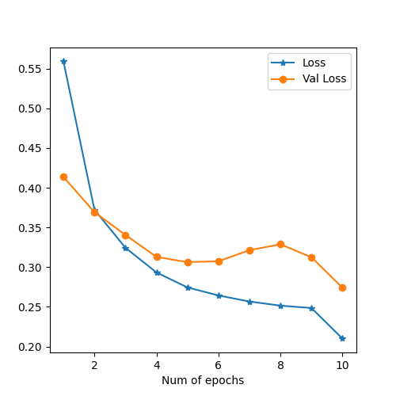


* defense (Distillation) model architecture
    ```
    class NetF(nn.Module):
        def __init__(self):
            super(NetF, self).__init__()
            self.conv1 = nn.Conv2d(1, 32, 3, 1)
            self.conv2 = nn.Conv2d(32, 64, 3, 1)
            self.dropout1 = nn.Dropout(0.25)
            self.dropout2 = nn.Dropout(0.5)
            self.fc1 = nn.Linear(9216, 128)
            self.fc2 = nn.Linear(128, 10)

        def forward(self, x):
            x = self.conv1(x)
            x = F.relu(x)
            x = self.conv2(x)
            x = F.relu(x)
            x = F.max_pool2d(x, 2)
            x = self.dropout1(x)
            x = torch.flatten(x, 1)
            x = self.fc1(x)
            x = F.relu(x)
            x = self.dropout2(x)
            x = self.fc2(x)
            return x

    class NetF1(nn.Module):
        def __init__(self):
            super(NetF1, self).__init__()
            self.conv1 = nn.Conv2d(1, 16, 3, 1)
            self.conv2 = nn.Conv2d(16, 32, 3, 1)
            self.dropout1 = nn.Dropout(0.25)
            self.dropout2 = nn.Dropout(0.5)
            self.fc1 = nn.Linear(4608, 64)
            self.fc2 = nn.Linear(64, 10)

        def forward(self, x):
            x = self.conv1(x)
            x = F.relu(x)
            x = self.conv2(x)
            x = F.relu(x)
            x = F.max_pool2d(x, 2)
            x = self.dropout1(x)
            x = torch.flatten(x, 1)
            x = self.fc1(x)
            x = F.relu(x)
            x = self.dropout2(x)
            x = self.fc2(x)
            return x
    ```
    * defense modelF loss  
        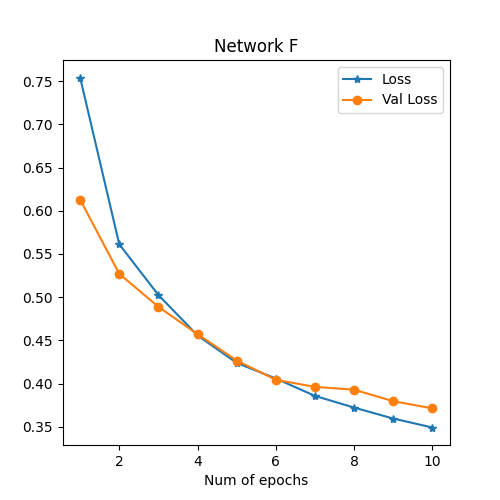

    * defense modelF1 (train with soft label) loss  
        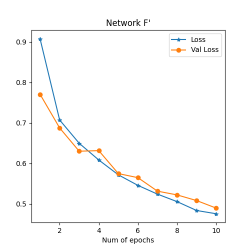

* attack original model result
    * accuracy each epsilon  
        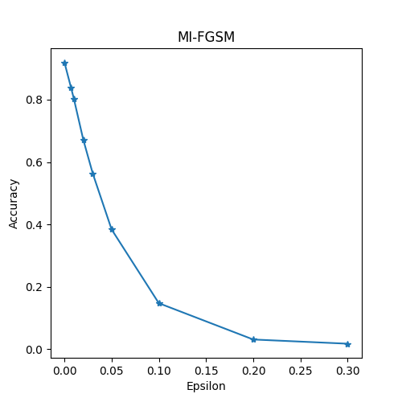
    * result  
        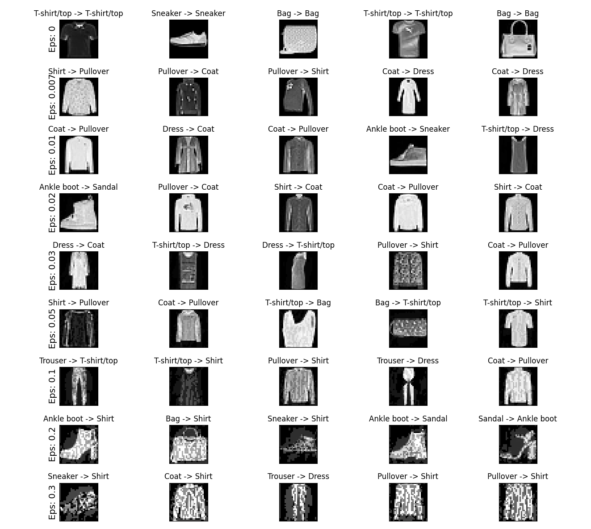

* attack defense (Distillation) model result
    * accuracy each epsilon  
        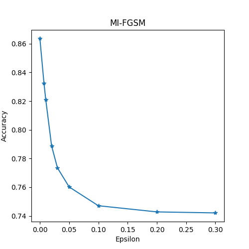
    * result  
        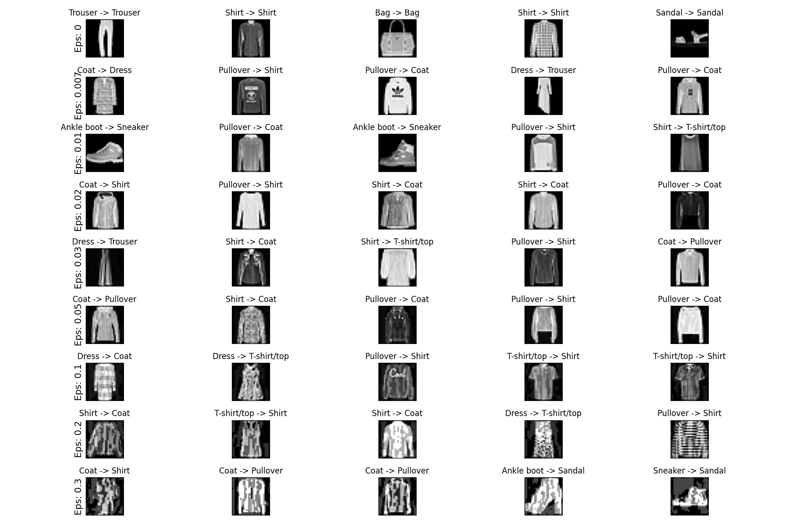


## CIFAR10
* original model architecture
    ```
    class Net(nn.Module):
        # neural network model
        def __init__(self):
            super(Net, self).__init__()
            self.PictureSize = 32
            self.conv1 = nn.Conv2d(3, 64, 3, 1)
            self.conv2 = nn.Conv2d(64, 128, 3, 1)
            self.dropout1 = nn.Dropout(0.25)
            self.dropout2 = nn.Dropout(0.5)
            self.PictureSize -= 2*2 # two conv layer with kernel=3 stride = 1
            self.PictureSize = int(self.PictureSize/2) # pool layer 2*2 
            self.fc1 = nn.Linear(128*self.PictureSize*self.PictureSize , 256)
            self.fc2 = nn.Linear(256, 10)

        def forward(self, x):
            x = self.conv1(x)
            x = F.relu(x)
            x = self.conv2(x)
            x = F.relu(x)
            x = F.max_pool2d(x, 2)
            x = self.dropout1(x)
            x = torch.flatten(x, 1)
            x = self.fc1(x)
            x = F.relu(x)
            x = self.dropout2(x)
            x = self.fc2(x)
            output = F.log_softmax(x, dim=1)
            return output
    ```
    * original model loss  
        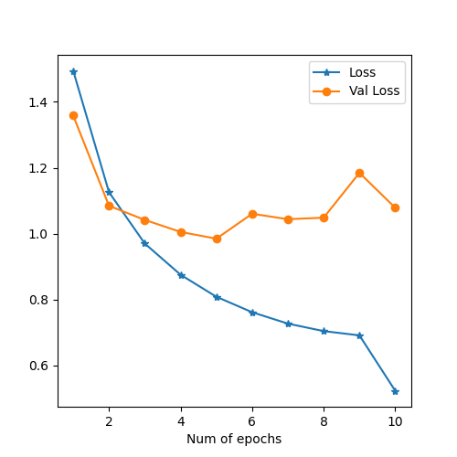


* defense (Distillation) model architecture
    ```
    class NetF(nn.Module):
        def __init__(self):
            # for FashionMNIST
            super(NetF, self).__init__()
            self.conv1 = nn.Conv2d(3, 64, 3, 1)
            self.conv2 = nn.Conv2d(64, 128, 3, 1)
            self.dropout1 = nn.Dropout(0.25)
            self.dropout2 = nn.Dropout(0.5)
            self.fc1 = nn.Linear(25088, 256)
            self.fc2 = nn.Linear(256, 10)

        def forward(self, x):
            x = self.conv1(x)
            x = F.relu(x)
            x = self.conv2(x)
            x = F.relu(x)
            x = F.max_pool2d(x, 2)
            x = self.dropout1(x)
            x = torch.flatten(x, 1)
            x = self.fc1(x)
            x = F.relu(x)
            x = self.dropout2(x)
            x = self.fc2(x)
            return x

    class NetF1(nn.Module):
        def __init__(self):
            super(NetF1, self).__init__()
            self.conv1 = nn.Conv2d(3, 32, 3, 1)
            self.conv2 = nn.Conv2d(32, 64, 3, 1)
            self.dropout1 = nn.Dropout(0.25)
            self.dropout2 = nn.Dropout(0.5)
            self.fc1 = nn.Linear(12544, 128)
            self.fc2 = nn.Linear(128, 10)

        def forward(self, x):
            x = self.conv1(x)
            x = F.relu(x)
            x = self.conv2(x)
            x = F.relu(x)
            x = F.max_pool2d(x, 2)
            x = self.dropout1(x)
            x = torch.flatten(x, 1)
            x = self.fc1(x)
            x = F.relu(x)
            x = self.dropout2(x)
            x = self.fc2(x)
            return x
    ```
    * defense modelF loss  
        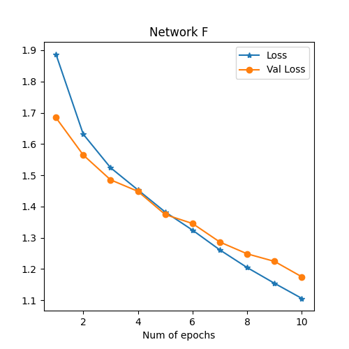

    * defense modelF1 (train with soft label) loss  
        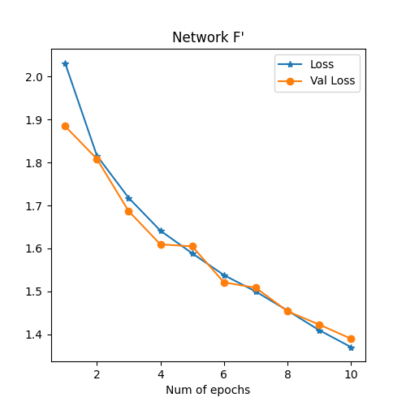

* attack original model result
    * accuracy each epsilon  
        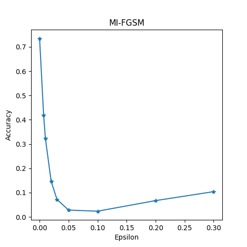
    * result  
        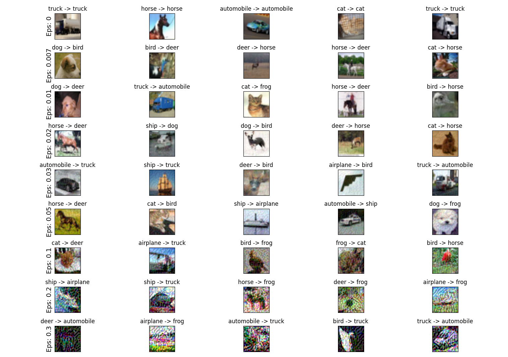

* attack defense (Distillation) model result
    * accuracy each epsilon  
        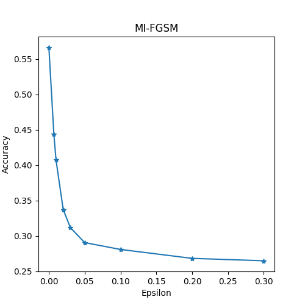
    * result  
        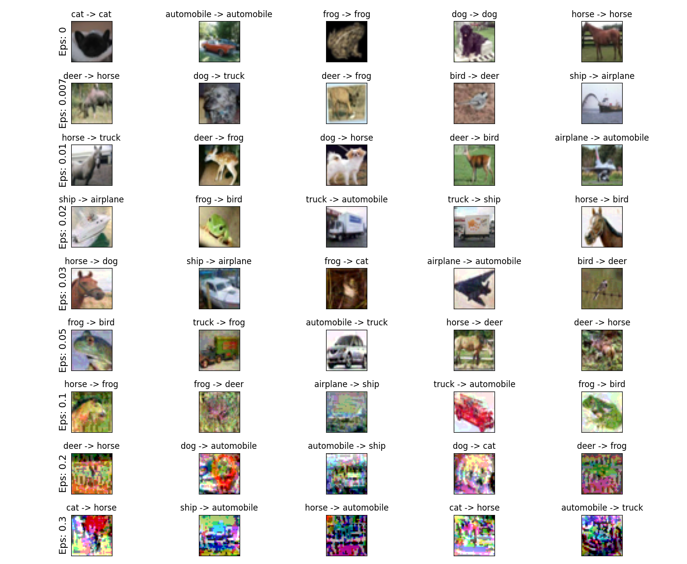